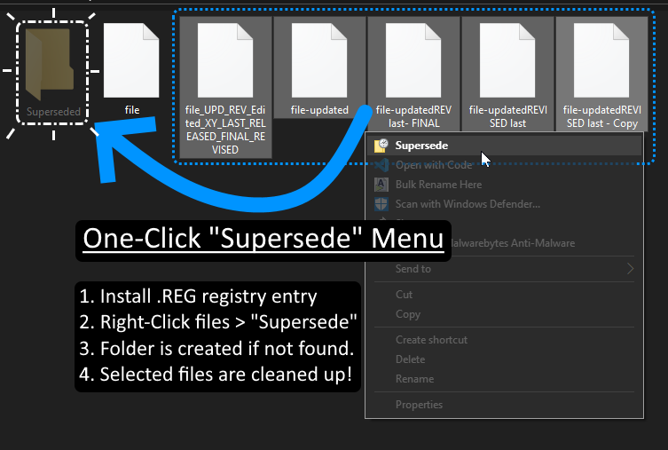

# "Supersede" ContextMenu [Windows]
Add a context-menu item to "supersede" files (move them to .\Superseded)
## About
Add a right-click context menu for all files, to quickly clean up a folder [Windows].
### Why?
I was filling in for someone working with graphic artists who use the infamous "last-revised-final" naming-scheme.
When I identify old revisions of drawings (etc), this was a quick way to quickly "sweep" them into an archive folder without breaking focus.

## Setup
1. Double-click `Supersede.Reg` to run it.
1. Approve adding it to your system registry.
1. Profit!

## Usage
1. Select some old files you wish to archive.
1. Right-Click **>** `Supersede`.
1. The selected files will be whisked away into `.\Superseded`.
> - If there is no "Superseded" folder, it will create one.
---

## Enhancement Possibilities
Beyond the scope of this quick tool, but other optional changes:
- Rename the archive folder:
  1. Edit `Superseded.reg` in your text-editor.
  1. Find `$S = \\\"Superseded\\\"` and replace the name with your desired folder: `$S = \\\"_archived\\\"` etc.
  1. Run the `Superseded.reg` file again to update your configuration.